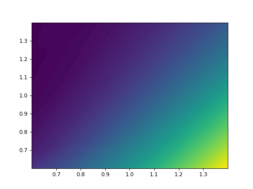
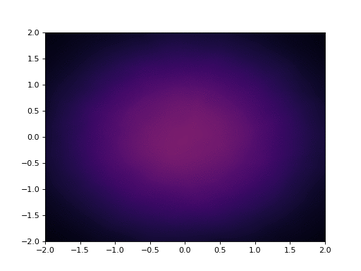

# Deep-PDE-Solvers

Code of numerical experiments in https://arxiv.org/abs/1810.05094.
 
       @misc{vidales2019unbiased,
              title={Unbiased deep solvers for parametric PDEs}, 
              author={Marc Sabate Vidales and David Siska and Lukasz Szpruch},
              year={2019},
              eprint={1810.05094},
              archivePrefix={arXiv},
              primaryClass={q-fin.CP}
        }

We use Feed Forward networks to price European options at any time t. 
We use two different learning algorithms:
- The BSDE method --> we also learn the hedging strategy
- Directly learn the price as the conditional expectation E[X_T | F_t], which is the orthogonal projection of X_T onto the sigma-algebra F_t. 

In addition, we de-bias the approximation of the solution of the PDE by leveraging Monte Carlo and the Deep Learning solution (see our [paper](https://arxiv.org/abs/1810.05094)). In that sense, the deep learning approximation of the stochastic integral arising from the Martingale representation of g(X_T) (where g is the payoff at time T) can be seen as a control variate. Under this perspective, we have another learning algorithm:
- Minimising the variance of g(X_T)-cv, where cv is the approximation of the stochastic integral. 


## Running the code

Pricing exchange options in the Black-Scholes world by solving the 2-dimensional PDE:
```
python pde_BlackScholes_exchange.py --use_cuda --device 0 --d 2
```
and visualizing the results
```
python pde_BlackScholes_exchange.py --d 2 --visualize
```

<p align="center">

</p>


Solving the 2-dimensional Heat equation with time reversed
```
python pde_Brownian.py --use_cuda --device 0 --d 2
```
and visualizing the results
```
python pde_Brownian.py --d 2 --visualize
```

<p align="center">

</p>
